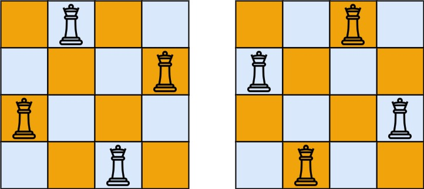

# The problem

The **n-queens** puzzle is the problem of placing `n` queens on an `n x n` chessboard such that no two queens attack each other.

Given an integer `n`, return _the number of distinct solutions to the **n-queens puzzle**_.

### Example 1:

**Input:** n = 4  
**Output:** 2
